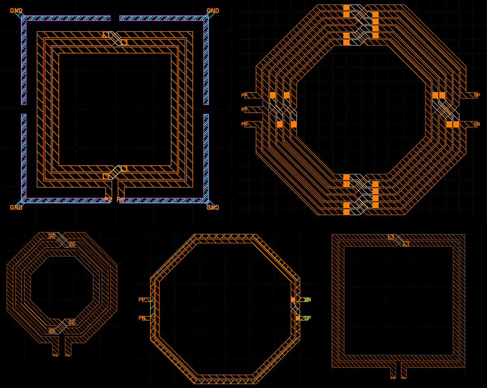

# pcLab - Passive Component Lab
pcLab is a collection of Python classes that generate GDSII layouts of integrated passive structures such as inductors and baluns. It can be installed by running
`pip install .`
in the top level directory.




## Creating inductor layout by value

The original pclab library was created to draw geometries for inductor and transformers from specified width, spacing, diameter and number of turns. By adding the `indcalc.py` functions, it is also possible to create an inductor shape for a given *target value*. An example for such inductor design by target value can be found in SG13G2 examples `inductor_SE_by_value.py` and `inductor_Sym_by_value.py`


## Technology file

To generate GDSII layouts of passive components you will need to write a technology file that describes available layers. Example of technology file for a generic process with 5 metal layers is given in `examples/generic_5M.tech`.

For IHP SG13G2 Open PDK technology, the technology file is provided in `examples_SG13G2/SG13G2.tech`.


### Defining technology grid

GDSII files are using a grid to which can be defined as
`grid <value in um>`
For example
`grid 0.01`
defines a grid of 10 nm.

### Defining a layer

Layers can be defined as
```
layer <layer name> [via | metal | implant | diffusion]
	<property> = <value>
endlayer
```
Layers of type `implant` and `diffusion` are used for creating guard rings in substrate, while `via` and `metal` layers can be used to construct structure geometry.

Properties of layers are summarized in the following table
| Property | Description |
|:-----------|:----------|
|`GDSIINum`  | GDSII layer number in the range [0, 255]. Used for all layer types.
|`GDSIIType` | GDSII layer type number in the range [0, 255]. Used for all layer types.
|`topmet`    | Name of via top metal layer. Valid only for vias.
|`botmet`    | Name of via bottom metal layer. Valid only for vias.
|`viaEnc`    | Via enclosure rule for generating DRC clean layouts.
|`viaSize`   | Via size for generating DRC clean layouts.
|`viaSpace`  | Via space for generating DRC clean layouts.

### Generic 5 metal technology file

Generic 5 metal technology file may look like this
```
# Generic 5 metal 130 nm techology
grid = 0.01

layer diff diffusion
    GDSIINum = 1
    GDSIIType = 0
endlayer

layer pimpl implant
    GDSIINum = 2
    GDSIIType = 0
endlayer

layer cont via
    GDSIINum = 3
    GDSIIType = 0

    topmet = M1
    botmet = diff
    viaEnc = 0.1
    viaSize = 0.2
    viaSpace = 0.28
endlayer

layer M1 metal
    GDSIINum = 15
    GDSIIType = 0
endlayer

layer M2 metal
    GDSIINum = 17
    GDSIIType = 0
endlayer

layer M3 metal
    GDSIINum = 19
    GDSIIType = 0
endlayer

layer M4 metal
    GDSIINum = 21
    GDSIIType = 0
endlayer

layer M5 metal
    GDSIINum = 23
    GDSIIType = 0
endlayer

layer V1 via
    GDSIINum = 16
    GDSIIType = 0
    topmet = M2
    botmet = M1
    viaEnc = 0.1
    viaSize = 0.2
    viaSpace = 0.28
endlayer

layer V2 via
    GDSIINum = 18
    GDSIIType = 0
    topmet = M3
    botmet = M2
    viaEnc = 0.1
    viaSize = 0.2
    viaSpace = 0.28
endlayer

layer V3 via
    GDSIINum = 20
    GDSIIType = 0
    topmet = M4
    botmet = M3
    viaEnc = 0.1
    viaSize = 0.2
    viaSpace = 0.28
endlayer

layer V4 via
    GDSIINum = 22
    GDSIIType = 0
    topmet = M5
    botmet = M4
    viaEnc = 0.2
    viaSize = 0.4
    viaSpace = 0.4
endlayer
```

## A small example

A small example on how to generate an inductor layout is:

``` python
from pclab import *
tech = Technology("generic_5M.tech") # load technology file
ind = inductorSE(tech) # make an instance of a single-ended inductor 
                       # layout generator for a technology tech
# Define inductor geometry parameters
r_outer = 200.0
w = 8.0
s = 2.0
nturns = 2.0
sig_lay = "M5"
underpass_lay = "M4"
ind_geom = "octagon" # valid choices: "rect", "octagon"
# Define substrate guard ring parameters
subRingSpace = 20.0
subRingW = 6.0
diffLayer = "diff"
implantLayer = "pimpl"
# Generate regular layout
ind.setupGeometry(r_outer, w, s, nturns, sig_lay, underpass_lay, ind_geom)
ind_name = "inductorSE_" + ind_geom + "_r_outer" + str(r_outer) + "_w" +  str(w) + "_n" + str(nturns) + "_s" + str(s)
ind.genGeometry()
ind.genGDSII(ind_name + '.gds', structName = ind_name)
```
Other examples on supported layout generators are in the `examples` directory.

## Creating layout for EM simulation

### Via array merging

Layouts can be created with via arrays represented by as single bounding box polygon, by using this switch:
```python
ind.setEmVias(True)
```

### Creating pins and ground frame for EM simulation

The gds2palace EM simulation flow is supported by function `gds_pin2viaport()` defined in pclab/pin2port.py. Using this function will create a new GDSII file where component pins are converted to via port geometries for the gds2palace simulation flow, and a ground frame is added as the common ground reference for all ports. 

